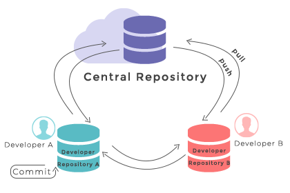

Alguns dias atrás fiz uma apresentação sobre git para alguns colegas de trabalho. O público era de engenheiros com alguma experiência em programação aplicada em engenharia, porém nunca tiveram contato com softwares de controle de versão.

Adaptei a apresentação para um post. Espero que possa ser útil para você também.

---

## Git x GitLab x GitHub

- git: software de controle de versão
- GitLab e GitHub: provedores de repositórios remotos (não é obrigatório usá-los)

---

## Funcionamento

- Controle de versão __distribuído__: cada um pode editar o mesmo arquivo simultaneamente
- repositório local (sua máquina) vs repositório remoto (GitLab)
- as mudanças (_commits_) só vão para o repositório remoto depois do comando `pull`
    - caso as mudanças do `pull` causem conflito elas não serão aplicadas (até que se resolvam todos os conflitos)



---

## Instalação (Windows)

- Instalar com todas as opções recomendadas ativadas: [Git](https://git-scm.com/)

- Instalar o Windows Terminal (opcional; facilita algumas tarefas). [Get Windows Terminal - Microsoft Store](https://www.microsoft.com/store/productId/9N0DX20HK701)

- Instalar uma GUI (interface gráfica) para facilitar o uso. Recomendo o [GitHub Desktop](https://desktop.github.com/). Outra opção é usar um editor de texto com interface do git integrada. Minha recomendação: [Visual Studio Code](https://code.visualstudio.com/)

---

## Configuração das chaves ssh


Os itens 4 e 5 abaixo são específicos para o GitLab. Porém, em outros provedores serão semelhantes.


1. As chaves ssh são a "senha" que o git usa para poder acessar os repositórios remotos
2. Após instalação do git, abrir terminal e digitar `git-gui`
3. Help > Show SSH Key > Generate Key > Copy to clipboard
4. Logar no GitLab > Profile > Preferences > SSH Keys ([link direto](https://gitlab.com/-/profile/keys))
5. Colar chave, selecionar data de validade (coloque pelo menos 1 ano) > adicionar
6. Adicionar o gitlab nos "known hosts": Abrir o Terminal > `ssh git@gitlab.com` > `yes`


Pronto, agora o git de sua máquina local conseguirá autenticar nos seus repositórios que estão no GitLab. Note que se o repositório remoto estiver em outro servidor (ex. GitHub, esse processo tem que ser repetido lá).

---

## Configuração do git

Abrir o Terminal:

```bash
$ git config --global user.name "John Doe"
$ git config --global user.email johndoe@example.com
```
Essas informações aparecerão nos _commits_ feitos por você.

---

## Operações básicas

### Commit

- É o registro de uma alteração no código.
- É o análogo à operação "salvar" de um documento Word.
- É obrigatório adicionar uma "commit message": frase curta que descreve o que foi alterado

### Pull / Push

- Pull: trazer commits novos do remoto → local
- Push: enviar commits novos do local → remoto
    - pode resultar em erro se os seus commits entrarem em conflito com os que estão no repositório remoto

### Criar repositório

- Iniciar essa operação primeiro no GitLab/GitHub
- Atenção ao passo de "initialize with README" caso pretenda fazer upload de uma pasta já existente

### Branch e Merge

- Branch são "versões" diferentes do seu código, que co-existem no seu  repositório
- Uso: quando você quer desenvolver um novo recurso no seu código, mas não quer alterar o que já está funcionando: crie uma branch nova e vá fazendo commits nessa nova branch. Quando tudo estiver funcionando como esperado, faça o merge dessa branch com a master


### Resolver conflitos

Ler este artigo: [Sobre conflitos de merge](https://docs.github.com/pt/github/collaborating-with-issues-and-pull-requests/about-merge-conflicts)

### "Voltar no tempo"

```bash
git checkout <comitt-sha>
```

- Caso queira só ler o código é mais prático navegar pelo GitLab/GitHub.

---

## Tópicos adicionais

- Arquivo `.gitignore`
    - usado para definir arquivos e pastas que não devem ser rastreados. [Exemplo](https://github.com/OpenFAST/openfast/blob/main/.gitignore) 

---

## Boas práticas ao escrever códigos

O código deve ser organizado e legível o suficiente para que possa ser lido e entendido por outra pessoa e também por você mesmo após alguns meses. A "dica" que mais contribui para escrever um código legível é:
- nomes de variáveis descritivos
- não usar números mágicos

O código deve ser auto-explicativo, muitas vezes sem necessidade de comentários. Se você precisa fazer um comentário para explicar o que está fazendo no código, talvez seja um sinal que não respeitou as premissas acima.

Leitura recomendada: [Clean Code: Naming](https://betterprogramming.pub/clean-code-naming-b90740cbae12)

Exemplos:

Nomes de variáveis devem ser descritivos:

```python
# ruim:
sigma = E * A * epsilon

# bom:
axial_tension = youngModulus * displacement / length
```

Não usar "números mágicos":

```python
# ruim:
if stress < 860e6:
	...

# bom:
allowable_stress = 860E6

if stress < allowable_stress:
	...
```